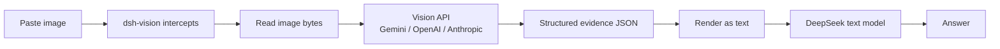

# dsh-vision

[中文](README.md) · **English** · [日本語](README.ja.md) · [한국어](README.ko.md)

[](LICENSE)
[](https://github.com/JASONWONG1124/dsh-vision/stargazers)
[](https://nodejs.org)

Gives [DeepSeek Harness](https://github.com/deepseek-ai/deepseek-harness)'s text-only models the ability to see. **Paste an image and it just works** — no CLI. Fill in one vision-model API key and the plugin calls the vision API directly over HTTP, turning the image into structured evidence (full OCR + semantics + layout + visual) before handing it to the text model.

## Table of Contents

- [Features](#features)
- [How it works](#how-it-works)
- [Installation](#installation)
- [Configuration](#configuration)
- [Usage](#usage)
- [What the model sees](#what-the-model-sees)
- [Security](#security)
- [Troubleshooting](#troubleshooting)
- [FAQ](#faq)
- [License](#license)

## Features

- **Paste-to-see**: no saving to file, no commands — just paste.
- **Zero CLI**: nothing to install or spawn; one API key is all you need.
- **Three engines, freely switchable**: Google Gemini, OpenAI-compatible (Qwen / GLM / self-hosted), Anthropic Claude.
- **Structured evidence**: full transcription + layout regions + entities/relations + colors/style + an uncertainty list, so the model quotes evidence instead of guessing.
- **GUI configuration**: pick the provider, paste the key, change the model — all in the settings panel, no config file editing.
- **Injection-safe**: the image is treated strictly as data, and the vision model is explicitly told to never follow instructions inside the image.

## How it works

DeepSeek's text model can't take images, so pasting one is rejected at image admission. The plugin solves this with three mechanisms:

1. **`read_image` tool** — the model reads an image on demand (local path or http(s) URL).
2. **"(dsh-vision)" model variant** — registers a new provider that declares image support, so admission passes; at request time the image is rewritten into evidence text before delegating to the real DeepSeek route. Pasting with this variant keeps the native thumbnail.
3. **Paste takeover** — on the default text-only model, the browser intercepts the paste, uploads the bytes, inserts a temp-file path as text, and `read_image` reads it.

Data flow (the vision engine is the "eyes"; DeepSeek only reads text):



> Image pixels never reach DeepSeek; it reads the text evidence the vision engine wrote.

## Installation

> Prerequisite: `pnpm` must be installed (`npm i -g pnpm`, or `corepack enable pnpm`).

Install directly from GitHub (recommended):

```sh
npx -y @deepseek-ai/dsh plugin --profile web add github:JASONWONG1124/dsh-vision
```

Then **restart `dsh web`**.

For local development (changes take effect immediately):

```sh
npx -y @deepseek-ai/dsh plugin --profile web add link:/path/to/dsh-vision
```

## Configuration

Three ways — pick one; **the GUI is recommended**.

### Option 1: GUI (recommended)

After restarting, open **Settings → Plugins → Plugin configuration → 视觉理解 (dsh-vision)** and:

- pick the **provider** (Gemini / OpenAI-compatible / Anthropic);
- fill in the **API Key** (the eye icon toggles visibility so you can double-check the characters; the key persists);
- fill in the **model** and **base URL** (leave blank to use the provider default);
- press **Save**.

### Option 2: Config file

Create `~/.dsh-vision/config.json` (permissions `600` recommended):

```json
{
  "provider": "gemini",
  "gemini": {
    "apiKey": "your-gemini-key",
    "model": "gemini-3.6-flash",
    "baseUrl": "https://generativelanguage.googleapis.com"
  },
  "openai": {
    "apiKey": "",
    "model": "qwen-vl-max",
    "baseUrl": "https://dashscope.aliyuncs.com/compatible-mode/v1"
  },
  "anthropic": {
    "apiKey": "",
    "model": "claude-sonnet-4-5",
    "baseUrl": "https://api.anthropic.com"
  }
}
```

### Option 3: Environment variables

```sh
export GEMINI_API_KEY=...        # or OPENAI_API_KEY / ANTHROPIC_API_KEY
export VISION_PROVIDER=gemini     # gemini | openai | anthropic
```

### Supported providers

| Provider | Default base URL | Notes |
| :-- | :-- | :-- |
| `gemini` | `https://generativelanguage.googleapis.com` | Free key at [Google AI Studio](https://aistudio.google.com) |
| `openai` | `https://api.openai.com/v1` | Any OpenAI-compatible endpoint: OpenAI, Qwen-VL, GLM, self-hosted gateway |
| `anthropic` | `https://api.anthropic.com` | Anthropic Claude |

> **What the provider choice means**: `provider` decides which vision API is actually called when reading an image (which key + model). Each provider's key/model/base URL is stored independently; switching `provider` only switches the active one and never clears the others.

## Usage

- **Method A (recommended, keeps the thumbnail)**: switch the model selector to `DeepSeek-V4-Pro (dsh-vision)` and paste the image.
- **Method B (default model)**: don't switch models; paste the image, which becomes a path, and the model calls `read_image` automatically.

## What the model sees

The vision engine converts the image into structured fields, then renders them as text for the text model:

| Field | Meaning |
| :-- | :-- |
| `summary` | One-sentence summary |
| `ocr.full_text` | All text in the image (transcribed verbatim, not translated) |
| `layout.regions` | Layout regions (title/paragraph/table/chart/form…), in reading order |
| `semantics` | `scene` / `intent` / `entities` / `relations` |
| `visual` | `dominant_colors` / `style` / `notes` |
| `uncertainty` | Anything unreadable or ambiguous (stated honestly, never guessed) |

## Security

- The image is treated strictly as data; the prompt tells the vision model to never follow instructions inside the image (injection resistance).
- Paste uploads are magic-byte checked and size-capped; API keys are redacted from errors.

## Troubleshooting

| Symptom | Cause & fix |
| :-- | :-- |
| "failed to read image … no key" | Fill the API key in the settings card, or check `~/.dsh-vision/config.json` |
| `503` / `429` (high load / rate limit) | Temporary provider load; retry later or switch providers |
| "model … is no longer available" | The model is deprecated; use a current model (e.g. `gemini-3.6-flash`) |
| `dsh plugin add` says "pnpm not found" | Install pnpm: `npm i -g pnpm` or `corepack enable pnpm` |
| `declares no dsh.bundle` | Brief publish cooldown; re-run the install command |

## FAQ

**Q: Is my image uploaded to a third party?**

Yes — when reading an image it is sent to the vision provider you chose in settings (Gemini / OpenAI-compatible / Anthropic), and nowhere else.

**Q: Does it cost money?**

Vision APIs are billed per call: Gemini has a free tier (get a key at [Google AI Studio](https://aistudio.google.com)); OpenAI / Anthropic bill by usage. The same image is cached within a session, so it isn't re-billed repeatedly.

**Q: Why can't DeepSeek's text-only model see images?**

There are two layers to this:

**1. The model has no "eyes" (architecture).** Models like DeepSeek-V4-Pro are **text-only** — they accept a sequence of text tokens and produce text. Multimodal models (GPT-4o, Gemini, Claude) add a **vision encoder** that first turns an image into "image tokens" to reason over alongside text; a text-only model simply has no such component, so pixels mean nothing to it. It's not that it "refuses" images — it has no input channel for them at all.

**2. Even with an image, it's blocked at admission (harness layer).** Before sending a message, DeepSeek Harness asks the current model's adapter: "what input modalities do you support?" The official DeepSeek adapter **hardcodes `text` only**. So the moment you paste an image and send, the harness rejects it at the **image-admission** gate — the image never even reaches the model; the "model can't understand images" message comes from this gate, not from the model itself.

**3. How this plugin gets around it.** It registers a "(dsh-vision)" wrapper adapter that declares `text + image` support, so admission passes; then, before the request actually goes out, it hands the image to an external vision engine (Gemini / OpenAI / Anthropic) to turn it into text evidence, and replaces the image with that text. DeepSeek still only receives text — but now it can answer from that evidence.

**Q: Can it run fully locally / offline?**

The current version only calls cloud vision APIs. Fully offline would require a local vision model (a possible future direction).

**Q: Which image formats are supported?**

`png` / `jpeg` / `webp` / `gif`.

## License

MIT License

Copyright (c) 2026 JASON-WONG

Permission is hereby granted, free of charge, to any person obtaining a copy
of this software and associated documentation files (the "Software"), to deal
in the Software without restriction, including without limitation the rights
to use, copy, modify, merge, publish, distribute, sublicense, and/or sell
copies of the Software, and to permit persons to whom the Software is
furnished to do so, subject to the following conditions:

The above copyright notice and this permission notice shall be included in all
copies or substantial portions of the Software.

THE SOFTWARE IS PROVIDED "AS IS", WITHOUT WARRANTY OF ANY KIND, EXPRESS OR
IMPLIED, INCLUDING BUT NOT LIMITED TO THE WARRANTIES OF MERCHANTABILITY,
FITNESS FOR A PARTICULAR PURPOSE AND NONINFRINGEMENT. IN NO EVENT SHALL THE
AUTHORS OR COPYRIGHT HOLDERS BE LIABLE FOR ANY CLAIM, DAMAGES OR OTHER
LIABILITY, WHETHER IN AN ACTION OF CONTRACT, TORT OR OTHERWISE, ARISING FROM,
OUT OF OR IN CONNECTION WITH THE SOFTWARE OR THE USE OR OTHER DEALINGS IN THE
SOFTWARE.
