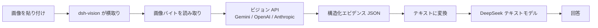

# dsh-vision

[中文](README.md) · [English](README.en.md) · **日本語** · [한국어](README.ko.md)

[](LICENSE)
[](https://github.com/JASONWONG1124/dsh-vision/stargazers)
[](https://nodejs.org)

[DeepSeek Harness](https://github.com/deepseek-ai/deepseek-harness) のテキスト専用モデルに視覚を追加します。**画像を貼り付けるだけで認識**でき、CLI は不要 —— 視覚モデルの API キーを1つ入力するだけで、プラグインが HTTP で直接ビジョン API を呼び、画像を構造化エビデンス(OCR全文 + 意味 + レイアウト + 視覚)へ変換してからテキストモデルへ渡します。

## 目次

- [特徴](#特徴)
- [仕組み](#仕組み)
- [インストール](#インストール)
- [設定](#設定)
- [使い方](#使い方)
- [モデルが見るもの](#モデルが見るもの)
- [セキュリティ](#セキュリティ)
- [トラブルシューティング](#トラブルシューティング)
- [FAQ](#faq)
- [License](#license)

## 特徴

- **貼り付けて見るだけ**:ファイル保存もコマンドも不要、貼り付けるだけ。
- **CLI 不要**:インストールや起動は不要。API キーが1つあれば動きます。
- **3つのエンジンを自由に切替**:Google Gemini、OpenAI 互換(通義千問 / GLM / 自前ゲートウェイ)、Anthropic Claude。
- **構造化エビデンス**:全文書き起こし + レイアウト領域 + エンティティ/関係 + 配色/スタイル + 不確実性リスト。モデルは推測せずエビデンスを引用します。
- **GUI で設定**:設定パネルでプロバイダ選択・キー入力・モデル変更ができ、設定ファイルを触る必要はありません。
- **プロンプトインジェクション対策**:画像は厳密に「データ」として扱い、画像内の指示には決して従わないよう明示します。

## 仕組み

DeepSeek のテキストモデルは画像を扱えないため、貼り付けは画像の受け入れ段階で拒否されます。このプラグインは次の3つの仕組みで解決します:

1. **`read_image` ツール** —— モデルが必要に応じて画像を読み取ります(ローカルパスまたは http(s) URL)。
2. **「(dsh-vision)」モデルバリアント** —— 画像対応を宣言する新しいプロバイダを登録して受け入れを通し、リクエスト時に画像をエビデンステキストへ書き換えてから本物の DeepSeek ルートへ委譲します。このバリアントでの貼り付けは**元のサムネイルを保持**します。
3. **貼り付けの乗っ取り** —— デフォルトのテキスト専用モデルでは、ブラウザが貼り付けを横取りしてバイトをアップロードし、一時ファイルのパスをテキストとして挿入し、`read_image` がそれを読み取ります。

データフロー(視覚エンジンが「目」で、DeepSeek が読むのはテキストのみ):



> 画像のピクセルが DeepSeek に届くことはありません。DeepSeek が読むのは視覚エンジンが書いたテキストエビデンスです。

## インストール

> 前提:`pnpm` が必要です(`npm i -g pnpm`、または `corepack enable pnpm`)。

GitHub から直接インストール(推奨):

```sh
npx -y @deepseek-ai/dsh plugin --profile web add github:JASONWONG1124/dsh-vision
```

インストール後、**`dsh web` を再起動**してください。

ローカル開発時(変更が即反映):

```sh
npx -y @deepseek-ai/dsh plugin --profile web add link:/path/to/dsh-vision
```

## 設定

3つの方法があります。**GUI を推奨します**。

### 方法1:GUI(推奨)

再起動後、**設定 → プラグイン → プラグイン設定 → 视觉理解 (dsh-vision)** を開き:

- **プロバイダ**を選択(Gemini / OpenAI 互換 / Anthropic);
- **API キー**を入力(目のアイコンで表示/非表示を切り替え、文字を確認できます。キーは保存されます);
- **モデル**と**ベース URL** を入力(空欄ならプロバイダ既定値を使用);
- **保存**を押します。

### 方法2:設定ファイル

`~/.dsh-vision/config.json` を作成(パーミッション `600` を推奨):

```json
{
  "provider": "gemini",
  "gemini": {
    "apiKey": "your-gemini-key",
    "model": "gemini-3.6-flash",
    "baseUrl": "https://generativelanguage.googleapis.com"
  },
  "openai": {
    "apiKey": "",
    "model": "qwen-vl-max",
    "baseUrl": "https://dashscope.aliyuncs.com/compatible-mode/v1"
  },
  "anthropic": {
    "apiKey": "",
    "model": "claude-sonnet-4-5",
    "baseUrl": "https://api.anthropic.com"
  }
}
```

### 方法3:環境変数

```sh
export GEMINI_API_KEY=...        # または OPENAI_API_KEY / ANTHROPIC_API_KEY
export VISION_PROVIDER=gemini     # gemini | openai | anthropic
```

### 対応プロバイダ

| プロバイダ | 既定ベース URL | 備考 |
| :-- | :-- | :-- |
| `gemini` | `https://generativelanguage.googleapis.com` | 無料キーは [Google AI Studio](https://aistudio.google.com) で取得 |
| `openai` | `https://api.openai.com/v1` | 任意の OpenAI 互換エンドポイント:OpenAI、通義千問 VL、GLM、自前ゲートウェイ |
| `anthropic` | `https://api.anthropic.com` | Anthropic Claude |

> **プロバイダ選択の意味**:`provider` は画像を読むときに実際に呼ぶビジョン API(どのキー + どのモデル)を決めます。各プロバイダのキー/モデル/ベース URL は**独立して保存**され、`provider` の切替は「現在有効なもの」を切り替えるだけで、他を消すことはありません。

## 使い方

- **方法A(推奨、サムネイル保持)**:モデル選択を `DeepSeek-V4-Pro (dsh-vision)` に切り替えて画像を貼り付けます。
- **方法B(デフォルトモデル)**:モデルを切り替えずに貼り付けます。画像はパスになり、モデルが自動的に `read_image` を呼びます。

## モデルが見るもの

ビジョンエンジンは画像を構造化フィールドへ変換し、それをテキストモデル向けのテキストとして描画します:

| フィールド | 意味 |
| :-- | :-- |
| `summary` | 一文の要約 |
| `ocr.full_text` | 画像内の全テキスト(逐語的に書き起こし、翻訳しない) |
| `layout.regions` | レイアウト領域(見出し/段落/表/グラフ/フォーム…)、読む順 |
| `semantics` | `scene` / `intent` / `entities` / `relations` |
| `visual` | `dominant_colors` / `style` / `notes` |
| `uncertainty` | 読めない・曖昧な箇所(推測せず正直に記す) |

## セキュリティ

- 画像は厳密に「データ」として扱い、画像内の指示には従わないよう明示します(インジェクション耐性)。
- 貼り付けアップロードはマジックバイト検査 + サイズ上限付き。エラーから API キーはマスクされます。

## トラブルシューティング

| 症状 | 原因と対処 |
| :-- | :-- |
| 「画像を読み取れません … キーなし」 | 設定カードで API キーを入力するか、`~/.dsh-vision/config.json` を確認 |
| `503` / `429`(高負荷・レート制限) | プロバイダ側の一時的な高負荷。後で再試行するか、別プロバイダへ切替 |
| 「model … is no longer available」 | モデルが廃止済み。現在使えるモデル(例 `gemini-3.6-flash`)へ変更 |
| `dsh plugin add` で「pnpm not found」 | pnpm を導入:`npm i -g pnpm` または `corepack enable pnpm` |
| `declares no dsh.bundle` | 公開直後の短いクールダウン。インストールコマンドをもう一度実行 |

## FAQ

**Q: 画像は第三者にアップロードされますか?**

はい —— 画像を読むとき、設定で選んだビジョンプロバイダ(Gemini / OpenAI 互換 / Anthropic)に送られます。それ以外へ送られることはありません。

**Q: 費用はかかりますか?**

ビジョン API は呼び出しごとに課金されます。Gemini は無料枠あり([Google AI Studio](https://aistudio.google.com) でキー取得)、OpenAI / Anthropic は従量課金です。同じ画像はセッション内でキャッシュされ、何度も課金されることはありません。

**Q: なぜ DeepSeek のテキスト専用モデルは画像を見られないのですか?**

これには2つの層があります:

**1. モデル自体に「目」がない(アーキテクチャ)。** DeepSeek-V4-Pro のようなモデルは**テキスト専用**で、テキストトークンの列を受け取り、テキストを出力します。マルチモーダルモデル(GPT-4o、Gemini、Claude)は**ビジョンエンコーダ**を持ち、画像をまず「画像トークン」へ変換してテキストと一緒に扱えますが、テキスト専用モデルにはその部品がなく、ピクセルを処理できません。「画像を拒否している」のではなく、そもそも画像を受け取る入力経路がないのです。

**2. 画像があっても「受け入れ」で遮断される(harness の層)。** DeepSeek Harness はメッセージを送る前に、現在のモデルの adapter に「対応する入力モダリティは?」と尋ねます。DeepSeek 公式の adapter は**`text` のみをハードコード**しています。そのため画像を貼り付けて送信した瞬間、**画像受け入れ**のゲートで拒否され、画像はモデルに届きません。「モデルは画像を理解できません」という表示は、このゲートが出すもので、モデル自身ではありません。

**3. このプラグインがどう回避するか。** 「(dsh-vision)」ラッパー adapter を登録して `text + image` を宣言し、受け入れを通します。そして実際にリクエストを送る前に、画像を外部ビジョンエンジン(Gemini / OpenAI / Anthropic)へ渡してテキストエビデンスへ変換し、画像をそのテキストへ置き換えます。DeepSeek が受け取るのは依然としてテキストだけですが、そのエビデンスに基づいて回答できるようになります。

**Q: 完全にローカル / オフラインで動きますか?**

現在のバージョンはクラウドのビジョン API のみです。完全オフラインにはローカルビジョンモデルが必要です(今後の方向性として検討可能)。

**Q: 対応画像形式は?**

`png` / `jpeg` / `webp` / `gif`。

## License

MIT License

Copyright (c) 2026 JASON-WONG

Permission is hereby granted, free of charge, to any person obtaining a copy
of this software and associated documentation files (the "Software"), to deal
in the Software without restriction, including without limitation the rights
to use, copy, modify, merge, publish, distribute, sublicense, and/or sell
copies of the Software, and to permit persons to whom the Software is
furnished to do so, subject to the following conditions:

The above copyright notice and this permission notice shall be included in all
copies or substantial portions of the Software.

THE SOFTWARE IS PROVIDED "AS IS", WITHOUT WARRANTY OF ANY KIND, EXPRESS OR
IMPLIED, INCLUDING BUT NOT LIMITED TO THE WARRANTIES OF MERCHANTABILITY,
FITNESS FOR A PARTICULAR PURPOSE AND NONINFRINGEMENT. IN NO EVENT SHALL THE
AUTHORS OR COPYRIGHT HOLDERS BE LIABLE FOR ANY CLAIM, DAMAGES OR OTHER
LIABILITY, WHETHER IN AN ACTION OF CONTRACT, TORT OR OTHERWISE, ARISING FROM,
OUT OF OR IN CONNECTION WITH THE SOFTWARE OR THE USE OR OTHER DEALINGS IN THE
SOFTWARE.
