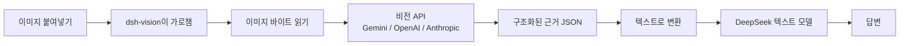

# dsh-vision

[中文](README.md) · [English](README.en.md) · [日本語](README.ja.md) · **한국어**

[](LICENSE)
[](https://github.com/JASONWONG1124/dsh-vision/stargazers)
[](https://nodejs.org)

[DeepSeek Harness](https://github.com/deepseek-ai/deepseek-harness)의 텍스트 전용 모델에 시각 능력을 더합니다. **이미지를 붙여넣기만 하면 인식**되며 CLI가 필요 없습니다. 시각 모델 API 키 하나만 입력하면 플러그인이 HTTP로 비전 API를 직접 호출해 이미지를 구조화된 근거(OCR 전체 텍스트 + 의미 + 레이아웃 + 시각)로 바꾼 뒤 텍스트 모델에 전달합니다.

## 목차

- [특징](#특징)
- [작동 원리](#작동-원리)
- [설치](#설치)
- [설정](#설정)
- [사용법](#사용법)
- [모델이 보는 것](#모델이-보는-것)
- [보안](#보안)
- [문제 해결](#문제-해결)
- [FAQ](#faq)
- [License](#license)

## 특징

- **붙여넣기만 하면 인식**:파일 저장이나 명령 없이 그냥 붙여넣습니다.
- **CLI 불필요**:설치하거나 실행할 것이 없습니다. API 키 하나면 충분합니다.
- **3개 엔진을 자유롭게 전환**:Google Gemini, OpenAI 호환(통의 Qianwen / GLM / 자체 게이트웨이), Anthropic Claude.
- **구조화된 근거**:전체 텍스트 추출 + 레이아웃 영역 + 개체/관계 + 색상/스타일 + 불확실성 목록. 모델이 추측 대신 근거를 인용합니다.
- **GUI 설정**:설정 패널에서 공급자 선택·키 입력·모델 변경이 가능해 설정 파일을 건드릴 필요가 없습니다.
- **프롬프트 주입 방지**:이미지를 엄격히 "데이터"로 취급하며, 이미지 안의 지시를 따르지 않도록 명시합니다.

## 작동 원리

DeepSeek의 텍스트 모델은 이미지를 받을 수 없어 붙여넣기가 이미지 수용 단계에서 거부됩니다. 이 플러그인은 세 가지 메커니즘으로 해결합니다:

1. **`read_image` 도구** —— 모델이 필요할 때 이미지를 읽습니다(로컬 경로 또는 http(s) URL).
2. **"(dsh-vision)" 모델 변형** —— 이미지 지원을 선언하는 새 공급자를 등록해 수용을 통과시키고, 요청 시점에 이미지를 근거 텍스트로 바꾼 뒤 실제 DeepSeek 라우트에 위임합니다. 이 변형으로 붙여넣으면 **원본 썸네일이 유지**됩니다.
3. **붙여넣기 가로채기** —— 기본 텍스트 전용 모델에서는 브라우저가 붙여넣기를 가로채 바이트를 업로드하고, 임시 파일 경로를 텍스트로 삽입하며, `read_image`가 이를 읽습니다.

데이터 흐름(비전 엔진이 "눈"이고 DeepSeek은 텍스트만 읽음):



> 이미지 픽셀은 DeepSeek에 도달하지 않습니다. DeepSeek이 읽는 것은 비전 엔진이 작성한 텍스트 근거입니다.

## 설치

> 사전 요구:`pnpm`이 필요합니다(`npm i -g pnpm` 또는 `corepack enable pnpm`).

GitHub에서 직접 설치(권장):

```sh
npx -y @deepseek-ai/dsh plugin --profile web add github:JASONWONG1124/dsh-vision
```

설치 후 **`dsh web`을 재시작**하세요.

로컬 개발 시(변경 사항 즉시 반영):

```sh
npx -y @deepseek-ai/dsh plugin --profile web add link:/path/to/dsh-vision
```

## 설정

세 가지 방법이 있으며, **GUI를 권장**합니다.

### 방법 1:GUI(권장)

재시작 후 **설정 → 플러그인 → 플러그인 설정 → 视觉理解 (dsh-vision)** 을 열고:

- **공급자** 선택(Gemini / OpenAI 호환 / Anthropic);
- **API 키** 입력(눈 아이콘으로 표시/숨김을 전환해 문자를 확인할 수 있습니다. 키는 계속 저장됩니다);
- **모델**과 **기본 URL** 입력(비워두면 공급자 기본값 사용);
- **저장**을 누릅니다.

### 방법 2:설정 파일

`~/.dsh-vision/config.json` 생성(권한 `600` 권장):

```json
{
  "provider": "gemini",
  "gemini": {
    "apiKey": "your-gemini-key",
    "model": "gemini-3.6-flash",
    "baseUrl": "https://generativelanguage.googleapis.com"
  },
  "openai": {
    "apiKey": "",
    "model": "qwen-vl-max",
    "baseUrl": "https://dashscope.aliyuncs.com/compatible-mode/v1"
  },
  "anthropic": {
    "apiKey": "",
    "model": "claude-sonnet-4-5",
    "baseUrl": "https://api.anthropic.com"
  }
}
```

### 방법 3:환경 변수

```sh
export GEMINI_API_KEY=...        # 또는 OPENAI_API_KEY / ANTHROPIC_API_KEY
export VISION_PROVIDER=gemini     # gemini | openai | anthropic
```

### 지원 공급자

| 공급자 | 기본 URL | 설명 |
| :-- | :-- | :-- |
| `gemini` | `https://generativelanguage.googleapis.com` | 무료 키는 [Google AI Studio](https://aistudio.google.com)에서 발급 |
| `openai` | `https://api.openai.com/v1` | 모든 OpenAI 호환 엔드포인트:OpenAI, 통의 Qianwen VL, GLM, 자체 게이트웨이 |
| `anthropic` | `https://api.anthropic.com` | Anthropic Claude |

> **공급자 선택의 의미**:`provider`는 이미지를 읽을 때 실제로 호출할 비전 API(어느 키 + 어느 모델)를 결정합니다. 각 공급자의 키/모델/기본 URL은 **서로 독립적으로 저장**되며, `provider` 전환은 "현재 활성화된 것"만 바꾸고 다른 공급자의 설정을 지우지 않습니다.

## 사용법

- **방법 A(권장, 썸네일 유지)**:모델 선택기를 `DeepSeek-V4-Pro (dsh-vision)`으로 바꾸고 이미지를 붙여넣습니다.
- **방법 B(기본 모델)**:모델을 바꾸지 않고 붙여넣습니다. 이미지가 경로가 되고 모델이 자동으로 `read_image`를 호출합니다.

## 모델이 보는 것

비전 엔진이 이미지를 구조화된 필드로 변환한 뒤 텍스트 모델용 텍스트로 렌더링합니다:

| 필드 | 의미 |
| :-- | :-- |
| `summary` | 한 문장 요약 |
| `ocr.full_text` | 이미지 안의 모든 텍스트(번역 없이 그대로 추출) |
| `layout.regions` | 레이아웃 영역(제목/단락/표/차트/양식…), 읽는 순서 |
| `semantics` | `scene` / `intent` / `entities` / `relations` |
| `visual` | `dominant_colors` / `style` / `notes` |
| `uncertainty` | 읽을 수 없거나 모호한 부분(추측하지 않고 정직하게 표기) |

## 보안

- 이미지를 엄격히 "데이터"로 취급하며, 이미지 안의 지시를 따르지 않도록 명시합니다(주입 방지).
- 붙여넣기 업로드는 매직 바이트 검사 + 크기 제한 적용. 오류에서 API 키는 마스킹됩니다.

## 문제 해결

| 증상 | 원인과 해결 |
| :-- | :-- |
| "이미지를 읽지 못했습니다 … 키 없음" | 설정 카드에서 API 키를 입력하거나 `~/.dsh-vision/config.json` 확인 |
| `503` / `429`(부하/속도 제한) | 공급자 측 일시적 부하. 나중에 재시도하거나 다른 공급자로 전환 |
| "model … is no longer available" | 모델이 지원 중단됨. 현재 사용 가능한 모델(예 `gemini-3.6-flash`)로 변경 |
| `dsh plugin add`에서 "pnpm not found" | pnpm 설치:`npm i -g pnpm` 또는 `corepack enable pnpm` |
| `declares no dsh.bundle` | 게시 직후 짧은 쿨다운. 설치 명령을 다시 실행 |

## FAQ

**Q: 내 이미지가 제3자에게 업로드되나요?**

네 —— 이미지를 읽을 때 설정에서 선택한 비전 공급자(Gemini / OpenAI 호환 / Anthropic)에게 전송되며, 그 외 다른 곳에는 전송되지 않습니다.

**Q: 비용이 드나요?**

비전 API는 호출당 과금됩니다. Gemini는 무료 한도가 있고([Google AI Studio](https://aistudio.google.com)에서 키 발급), OpenAI / Anthropic은 사용량 기준 과금입니다. 같은 이미지는 세션 내에서 캐시되므로 반복해서 과금되지 않습니다.

**Q: 왜 DeepSeek의 텍스트 전용 모델은 이미지를 볼 수 없나요?**

여기에는 두 겹이 있습니다:

**1. 모델 자체에 "눈"이 없습니다(아키텍처).** DeepSeek-V4-Pro 같은 모델은 **텍스트 전용**으로, 텍스트 토큰 시퀀스만 받아 텍스트를 출력합니다. 멀티모달 모델(GPT-4o, Gemini, Claude)은 **비전 인코더**를 갖고 있어 이미지를 먼저 "이미지 토큰"으로 바꿔 텍스트와 함께 다루지만, 텍스트 전용 모델에는 그 부품 자체가 없어 픽셀을 처리할 수 없습니다. 이미지를 "거부"하는 것이 아니라, 이미지를 받을 입력 경로가 처음부터 없는 것입니다.

**2. 이미지가 있어도 "수용" 단계에서 차단됩니다(harness 계층).** DeepSeek Harness는 메시지를 보내기 전에 현재 모델의 adapter에 "어떤 입력 모달리티를 지원하나요?"라고 묻습니다. DeepSeek 공식 adapter는 **`text`만 하드코딩**되어 있습니다. 그래서 이미지를 붙여넣고 보내는 순간 **이미지 수용** 게이트에서 거부되어, 이미지는 모델에 도달하지도 못합니다. "모델이 이미지를 이해할 수 없습니다"라는 메시지는 이 게이트가 내는 것이지 모델 자신이 아닙니다.

**3. 이 플러그인이 어떻게 우회하는가.** "(dsh-vision)" 래퍼 adapter를 등록해 `text + image` 지원을 선언함으로써 수용을 통과시킵니다. 그런 다음 요청이 실제로 나가기 전에 이미지를 외부 비전 엔진(Gemini / OpenAI / Anthropic)에 넘겨 텍스트 근거로 바꾸고, 이미지를 그 텍스트로 교체합니다. DeepSeek이 받는 것은 여전히 텍스트뿐이지만, 이제 그 근거를 바탕으로 답할 수 있습니다.

**Q: 완전히 로컬 / 오프라인으로 실행할 수 있나요?**

현재 버전은 클라우드 비전 API만 호출합니다. 완전 오프라인은 로컬 비전 모델이 필요합니다(향후 방향으로 검토 가능).

**Q: 어떤 이미지 형식을 지원하나요?**

`png` / `jpeg` / `webp` / `gif`.

## License

MIT License

Copyright (c) 2026 JASON-WONG

Permission is hereby granted, free of charge, to any person obtaining a copy
of this software and associated documentation files (the "Software"), to deal
in the Software without restriction, including without limitation the rights
to use, copy, modify, merge, publish, distribute, sublicense, and/or sell
copies of the Software, and to permit persons to whom the Software is
furnished to do so, subject to the following conditions:

The above copyright notice and this permission notice shall be included in all
copies or substantial portions of the Software.

THE SOFTWARE IS PROVIDED "AS IS", WITHOUT WARRANTY OF ANY KIND, EXPRESS OR
IMPLIED, INCLUDING BUT NOT LIMITED TO THE WARRANTIES OF MERCHANTABILITY,
FITNESS FOR A PARTICULAR PURPOSE AND NONINFRINGEMENT. IN NO EVENT SHALL THE
AUTHORS OR COPYRIGHT HOLDERS BE LIABLE FOR ANY CLAIM, DAMAGES OR OTHER
LIABILITY, WHETHER IN AN ACTION OF CONTRACT, TORT OR OTHERWISE, ARISING FROM,
OUT OF OR IN CONNECTION WITH THE SOFTWARE OR THE USE OR OTHER DEALINGS IN THE
SOFTWARE.
